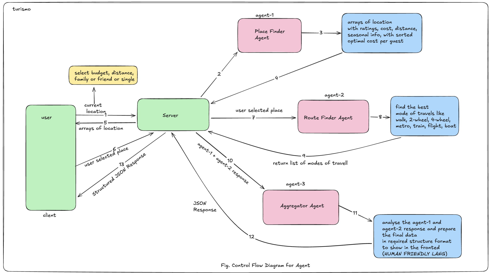

# Turismo: AI-Powered Travel Planning

Turismo is a next-generation travel planning application that leverages a multi-agent AI system to craft personalized, logistics-aware itineraries. It takes the stress out of travel planning by considering your budget, available time, and personal preferences to create a seamless journey.

## Key Features

- **Multi-Agent AI Planning**: Utilizes specialized AI agents (Place Finder Agent, Route Finder Agent, and Aggregator Agent) to research and organize your trip.
- **Intelligent Recommendations**: Get tailored place suggestions based on your location, budget (INR), and travel group (Solo, Couple, Family, Friends).
- **Logistics Optimization**: Real-time route calculation and transport mode recommendations for your selected destinations.
- **Seamless User Experience**: A clean, modern UI featuring a multi-step wizard to guide you from initial preferences to a final, ready-to-use itinerary.
- **Profile & History**: Save your favorite itineraries to your profile and access them anytime.
- **Global Search & Geolocation**: Search for any city globally or use your current location to start exploring immediately.

## System Architecture and Control Flow

The following diagram illustrates the interaction between the user, the server, and the specialized AI agents during the travel planning process:



1. User provides initial constraints (budget, distance, group type).
2. Server orchestrates the request to Agent-1 (Place Finder Agent).
3. Agent-1 identifies optimal locations with ratings and costs.
4. User selects preferred places from the recommendations.
5. Server sends selected places to Agent-2 (Route Finder Agent) to determine best travel modes.
6. Agent-3 (Aggregator Agent) synthesizes all data into a human-friendly itinerary.
7. Structured JSON response is returned to the client for display.

## Technology Stack

### Frontend
- **React 18**: Used for building a responsive and interactive user interface. Its component-based architecture is ideal for managing the state of the multi-step exploration wizard.
- **TanStack Query (React Query)**: Manages server state, providing efficient caching, synchronization, and background updates for AI-generated data.
- **React Hook Form + Zod**: Handles complex form state and client-side validation using schemas, ensuring that only valid data is sent to the AI agents.
- **Vanilla CSS**: Employs custom CSS variables and modern layout techniques to achieve a premium, high-performance design without the overhead of heavy frameworks.
- **Lucide React**: Provides a library of sleek, consistent icons that enhance the visual clarity of the itinerary and controls.
- **React Router 6**: Manages navigation and nested routes, allowing for a smooth transition between preferences, discovery, and result views.

### Backend
- **Node.js & Express**: Offers a high-performance, non-blocking environment for orchestrating complex, multi-step AI operations and API requests.
- **MongoDB & Mongoose**: A flexible document-based database used to store user profiles and heterogeneous itinerary structures.
- **Mistral AI**: Serves as the core "brain" of the system, powering the specialized agents for intelligent place discovery and content aggregation.
- **OSRM (Open Source Routing Machine)**: Provides high-speed routing calculations using OpenStreetMap data, ensuring logistics are based on real-world geography.
- **Nominatim**: Handles global geocoding and reverse geocoding, allowing users to search by city name or current GPS coordinates.
- **JWT (JSON Web Tokens)**: Implements secure, stateless authentication for protecting user data and saved itineraries.

## Project Structure

```text
├── client/                 # React Frontend
│   ├── src/
│   │   ├── components/    # Reusable UI components
│   │   ├── context/       # Context providers (Auth, Explore)
│   │   ├── hooks/         # Custom React hooks
│   │   ├── interfaces/    # TypeScript definitions
│   │   ├── pages/         # Page components (Landing, Explore, Results)
│   │   ├── schemas/       # Zod validation schemas
│   │   └── routes/        # API route definitions
├── server/                 # Node.js Backend
│   ├── src/
│   │   ├── agents/        # AI Agent logic (Place Finder, Route Finder, Aggregator)
│   │   ├── modules/       # Domain-driven modules (Auth, Itinerary, etc.)
│   │   │   └── auth/      # Each module contains its routes, controller, service, and model
│   │   ├── middleware/    # Custom Express middleware
│   │   ├── services/      # External integrations (Mistral, Maps)
│   │   └── utils/         # Standardized API response/error handlers
```

## Setup and Installation

### Prerequisites
- Node.js (v18+)
- MongoDB (Local or Atlas)
- Mistral AI API Key

### Backend Setup
1. Navigate to the `server` directory.
2. Install dependencies: `pnpm install`
3. Create a `.env` file based on the following template:
   ```env
   PORT=5000
   MONGODB_URI=your_mongodb_uri
   MISTRAL_API_KEY=your_mistral_key
   JWT_SECRET=your_secret_key
   NODE_ENV=development
   ```
4. Start the server: `pnpm run dev`

### Frontend Setup
1. Navigate to the root/client directory.
2. Install dependencies: `pnpm install`
3. Start the development server: `pnpm run dev`
4. Access the app at `http://localhost:5173`

## How the AI Agents Work

The core of Turismo is its collaborative multi-agent architecture. Each agent has a specific domain of expertise, working sequentially to build your trip.

### 1. Place Finder Agent
The Place Finder Agent is the first point of contact for your travel needs. Its primary responsibility is to research and identify potential points of interest. 
- **Input Processing**: It analyzes your constraints such as total budget, group type (e.g., family vs. solo), and specific interest categories.
- **Knowledge Retrieval**: Using Mistral AI, it scans for landmarks, hidden gems, and local favorites within your target area.
- **Scoring System**: Every found place is scored (0-100) based on rating, cost efficiency, time requirement, and relevance to your specific group profile.
- **Output**: A curated list of 7-10 places that best fit your profile.

### 2. Route Finder Agent
Once potential places are identified, the Route Finder Agent takes over to handle the practicalities of moving between them.
- **Routing Engine**: It interfaces with OSRM (Open Source Routing Machine) to calculate real-world distances and travel durations.
- **Multi-Modal Support**: It evaluates different transport modes (walking, driving, cycling) based on the city's infrastructure and the distance between points.
- **Contextual Tips**: It provides local advice for each leg of the journey, such as "Avoid this road during rush hour" or "The scenic walking path is highly recommended here."
- **Output**: Detailed route options for every transition in your trip.

### 3. Aggregator Agent
The final agent, the Aggregator Agent, synthesizes the work of the previous agents into a polished, actionable plan.
- **Time Blocking**: It organizes your day into logical blocks, accounting for arrival/departure times, time spent at each attraction, and transition buffers.
- **Contextual Narrative**: It generates a high-level summary of the entire trip, explaining why this specific combination of places was chosen for you.
- **Budget Balancing**: It ensures the total estimated cost (including entry fees and transport) remains within your specified budget limits.
- **Output**: A comprehensive, chronologically ordered itinerary that is saved to your profile and displayed as a timeline.

## License

This project is licensed under the MIT License - see the LICENSE file for details.