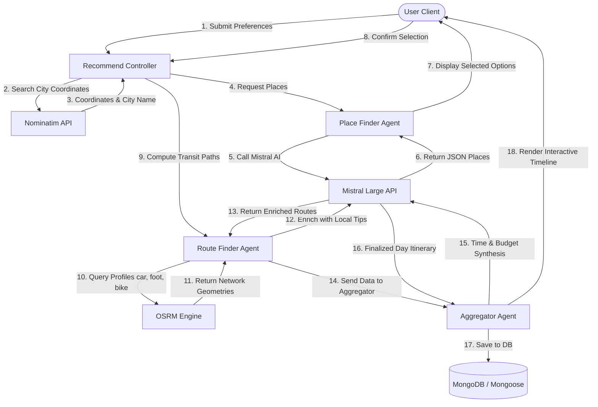

# Turismo: AI-Powered Travel Planning
## Complete Technical Documentation and Architectural Design

---

### Preface

This document serves as the comprehensive technical documentation and system design manual for the Turismo travel planning platform. The project is an exploration into the application of multi-agent artificial intelligence (MAS) and automated routing engines to solve the highly complex problem of itinerary planning. It is intended for software engineers, systems architects, and research assessors who wish to understand the inner workings, algorithmic foundations, and architectural patterns of the Turismo system.

The project demonstrates a hybrid computing paradigm where deterministic, graph-based routing algorithms (Open Source Routing Machine) are seamlessly combined with probabilistic, generative large language models (Mistral AI). By organizing these resources into a sequential, multi-agent workflow, the system achieves a degree of personalized contextual planning that neither rule-based systems nor pure generative models could achieve independently.

---

### Table of Contents
1. **Introduction and Project Scope**
   - 1.1 Introduction
   - 1.2 Motivation of the Project
   - 1.3 Basic Description of the Project
2. **Literature Review**
   - 2.1 General Review
   - 2.2 Review of Related Works
3. **Related Theories and Algorithms**
   - 3.1 Fundamental Theories Underlying the Work
   - 3.2 Fundamental Algorithms
4. **Proposed Model and Algorithms**
   - 4.1 Proposed Model (System Architecture)
   - 4.2 Proposed Algorithms (Agent Workflows)
5. **Implementation and Results**
   - 5.1 Website Features
   - 5.2 Differentiating Aspects
6. **Discussion and Conclusion**
   - 6.1 Discussion
   - 6.2 System Limitations
   - 6.3 Future Work
   - 6.4 Conclusion
7. **References**

---

### Chapter 1: Introduction and Project Scope

#### 1.1 Introduction
Travel planning is an intrinsically complex human activity that involves coordinating geographical constraints, temporal limits, financial bounds, and qualitative personal preferences. In computer science, this planning task is recognized as a variation of the Orienteering Problem (OP) and the Traveling Salesperson Problem with Time Windows (TSPTW), both of which are classified as NP-hard. Historically, travelers have had to act as their own heuristic planners, manually scraping and cross-referencing information across multiple platforms such as search engines, mapping applications, transport tables, hotel booking engines, and personal blogs.

Turismo introduces an automated, intelligent framework designed to eliminate this cognitive overhead. By utilizing a multi-agent system built on top of Large Language Models (LLMs) and open routing APIs, Turismo acts as an orchestrator that automates place discovery, travel logistics calculation, and chronological aggregation into a single unified workspace.

#### 1.2 Motivation of the Project
Turismo was created because travelers today face many problems while planning trips. They have to open different apps for hotels, flights, events, places to visit, and weather. This makes the process confusing and time-consuming. Platforms like MakeMyTrip and Goibibo also focus mainly on bookings, not discovery **[6,8]**, which increases the need for a unified exploration tool. Our project brings everything together in one website so that users can plan their trip easily.

While working on this project, we understood that people want a platform that is simple to use, gives updated information, and provides suggestions based on their interests, similar to discovery patterns used by Airbnb and Google Travel Insights **[2,5]**. The features such as event listings, maps, hotel search, recommendations, and a clean interface make Turismo useful for all types of travelers.

Overall, the project shows that a single platform for complete travel planning can save time, reduce confusion, and improve the user's travel experience—especially when using verified state tourism data **[9]** and map-based guidance through Google Maps APIs **[7]**.

In detail, the primary motivation behind Turismo stems from the inadequacy of standard digital solutions to provide cohesive, logistics-aware itineraries, which manifest in three structural problems:
1. **The Fragmented Interface Problem**: Travelers routinely maintain dozens of browser tabs open simultaneously (e.g., Google Maps, TripAdvisor, budget spreadsheets, and local transit schedules). The lack of cross-application communication forces the user to manually compute distance-time calculations.
2. **Logistics-Blind Generative AI**: While modern LLMs (such as OpenAI's GPT-4 or Mistral's models) can generate pleasant-sounding itineraries, they suffer from geographical hallucinations. They routinely suggest paths that defy physics, recommending activities in locations hundreds of kilometers apart within a two-hour window, or ignoring actual local transit constraints.
3. **Static Rule-Based Planners**: Traditional travel websites generate rigid, template-based itineraries. These templates cannot dynamically adapt to real-time variables such as seasonal weather changes, active local festivals, specific group configurations (e.g., solo travel vs. elderly-accessible family trips), and tight, non-standard budget caps.

By bridging generative AI with real-world spatial engines, Turismo aims to deliver itineraries that are not only highly personalized but also geographically and logistically valid.

#### 1.3 Basic Description of the Project
Turismo is built as a full-stack web application employing a decoupled client-server architecture:
- **Frontend Layer**: A responsive single-page application (SPA) implemented in React 18, TypeScript, and Vite. State management and server caching are handled by TanStack Query (React Query). Form verification is powered by React Hook Form coupled with Zod. The design system is implemented in pure, vanilla CSS using custom CSS variables (design tokens) to establish a premium, high-performance user interface.
- **Backend Layer**: A Node.js and Express server written in TypeScript. It serves as the orchestrator for the AI agents, authentication middlewares, database interactions, and map integrations.
- **Database Layer**: MongoDB (accessed via the Mongoose ODM) serves as the persistent storage engine, housing structured records of user credentials, user preference matrices, and saved travel itineraries.
- **External Services**:
  - *Mistral AI*: Utilizes the `mistral-large-latest` model to drive the Place Finder, Route Finder, and Aggregator agents.
  - *Nominatim*: Open-source geocoding service used to convert natural language queries into latitude/longitude coordinates and vice-versa.
  - *OSRM (Open Source Routing Machine)*: High-performance routing engine used to compute real-world distance and time matrices for driving, walking, and cycling profiles.

---

### Chapter 2: Literature Review

#### 2.1 General Review
The study of Automated Itinerary Planning (AIP) is situated at the intersection of Operations Research (OR) and Artificial Intelligence (AI). Early attempts at solving AIP formulated it strictly as a mathematical optimization problem. Specifically, the Traveling Salesperson Problem (TSP) **[1]** and the Orienteering Problem (OP) **[3]** model a set of vertices, each associated with a score (reward). The objective is to determine a path that maximizes the total collected score while keeping the total path length (or duration) below a predefined limit.

When time windows for visiting specific attractions are introduced, the problem becomes the Orienteering Problem with Time Windows (OPTW) **[4]**. While OR techniques like branch-and-price, column generation, and meta-heuristics (e.g., Genetic Algorithms, Ant Colony Optimization) solve these models effectively under strict mathematical assumptions, they fail when faced with the qualitative, messy nature of human preferences. A traveler does not merely want to maximize a numeric "score"; they require narrative flow, variety in place categories, safety, culinary integration, and atmospheric consistency.

#### 2.2 Review of Related Works

##### Commercial Platforms
- **TripIt & Sygic Travel**: These platforms excel at consolidating bookings (flights, hotels) and mapping places. However, the onus remains on the user to select the locations and assemble them. Recommendation engines on these platforms are largely based on simple popularity indexes and paid sponsorships, rather than tailored semantic alignment.
- **Inspirock (now integrated into major booking systems)**: Inspirock utilized a logic-rule framework to plan trips. While effective at logistics, it lacked conversational awareness and failed to capture the nuances of local occurrences, seasonal atmospheres, and modern lifestyle trends.

##### Academic and Generative AI Systems
- **Pure Conversational LLMs (e.g., ChatGPT-4, Claude 3)**: Since late 2022, travelers have used LLMs as travel assistants. LLMs possess immense world knowledge and can formulate creative itineraries. However, research has highlighted two critical limitations:
  1. *Spatial Inaccuracy*: LLMs do not verify distances. An itinerary might suggest visiting the Taj Mahal in Agra and the Hawa Mahal in Jaipur (approx. 240 km apart) on the same afternoon.
  2. *State Drift*: In long chat threads, LLMs struggle to keep track of accumulating costs and time bounds, often exceeding budgets and timelines without warning.
- **Multi-Agent Orchestration (e.g., CrewAI, AutoGen)**: Recent computer science research focuses on Multi-Agent Systems where separate LLM instances play specialized roles (e.g., planner, critic, researcher). While effective, raw MAS frameworks are slow, computationally expensive, and lack grounding in deterministic GIS databases.

##### Comparative Analysis
The table below contrasts Turismo's approach with existing paradigms:

| Feature | Traditional Search Engines | Pure LLM Chatbot | Turismo Hybrid MAS |
| :--- | :--- | :--- | :--- |
| **Personalization** | Low (Generic search results) | High (Text-based prompts) | Extremely High (Quantitative constraints & preferences) |
| **Logistical Rigor** | High (User manually maps routes) | Low (Prone to physical hallucinations) | Extremely High (Calculated via OSRM spatial graphs) |
| **Contextual Awareness** | Low | Medium (Within token context) | High (Explicit current-date and seasonal scoring) |
| **Computational Cost** | Very Low | Medium | Structured & Controlled (Deterministic API splits) |

---

### Chapter 3: Related Theories and Algorithms

#### 3.1 Fundamental Theories Underlying the Work

##### Multi-Agent Systems (MAS)
A Multi-Agent System consists of multiple autonomous components (agents) that interact to solve problems that are difficult for an individual agent **[13]**. In software engineering, MAS is used to implement separation of concerns in complex reasoning tasks. Rather than asking a single LLM call to find places, compute routes, balance the budget, and structure a day-plan (which leads to high cognitive load, loss of formatting, and hallucinations), the system breaks the process into a pipeline of specialized agents:
1. *Place Finder Agent*: Operates on constraints and preferences to discover locations.
2. *Route Finder Agent*: Operates on geographical locations to find routes and enrich them with transit details.
3. *Aggregator Agent*: Operates on the combined pool of places and routes to build the chronological plan.

##### Transformer Architecture and Prompt Constraining
The agents run on Mistral AI's Transformer-based LLM, applying the foundational attention mechanism **[12]**. The underlying theory relies on *in-context learning* and *structured decoding*. By using strict system prompts and specifying JSON schemas in the API request, the model is constrained to generate valid JSON objects. This allows the backend to programmatically parse, validate, and pass outputs from one agent as inputs to the next.

##### Geocoding and Spatial Coordinate Systems
The Nominatim API uses PostgreSQL/PostGIS. It matches strings against a hierarchical database of geographical entities. Spatial coordinates are represented as latitude and longitude in the WGS 84 coordinate system using spatial data from OpenStreetMap **[14]**.
For quick distance approximations before hitting the OSRM engine, the Haversine formula is used to calculate the great-circle distance between two points on a sphere:

$$d = 2r \arcsin \left( \sqrt{\sin^2\left(\frac{\Delta \phi}{2}\right) + \cos \phi_1 \cos \phi_2 \sin^2\left(\frac{\Delta \lambda}{2}\right)} \right)$$

Where:
- $\phi_1, \phi_2$ are the latitudes in radians.
- $\lambda_1, \lambda_2$ are the longitudes in radians.
- $r$ is the Earth's radius (approx. 6,371 km).
- $d$ is the shortest distance over the Earth's surface.

#### 3.2 Fundamental Algorithms

##### Contraction Hierarchies (CH) in OSRM
The Open Source Routing Machine utilizes Contraction Hierarchies (CH) **[10]** to solve the Shortest Path problem on road networks. Traditional Dijkstra or A* searches are too slow for real-time web services, requiring traversal of millions of road segments.
Contraction Hierarchies is a preprocessing technique:
1. **Node Ordering**: All nodes in the graph are ordered based on a heuristic value (reflecting their relative importance in the network).
2. **Contraction Step**: Nodes are removed (contracted) one by one in ascending order of importance. When a node $v$ is contracted, shortcut edges are added between its remaining neighbors $u$ and $w$ if the shortest path from $u$ to $w$ goes through $v$.
3. **Query Step**: A bidirectional Dijkstra search is executed. The search only progresses from less important nodes to more important nodes. Because of the shortcuts added during preprocessing, this search converges in microseconds, yielding the exact shortest path distance, duration, and geometry **[11]**.

##### Nominatim Search and Geocoding Algorithms
Nominatim indexes spatial data from OpenStreetMap. It tokenizes search strings, extracts search keywords, and checks them against precomputed hierarchies (Country -> State -> County -> City -> Suburb -> Street). It ranks matching entities based on coordinate distance to the search focus area and name similarity using trigram index matching in PostgreSQL.

##### Stateless Token Authentication (JWT)
To protect user dashboards and saved plans, the system uses JSON Web Tokens (JWT). The server issues a token containing user metadata and signs it with a secret key using HMAC-SHA256:

$$\text{Signature} = \text{HMAC-SHA256}(\text{base64UrlEncode}(\text{Header}) + "." + \text{base64UrlEncode}(\text{Payload}), \text{Secret})$$

The client transmits this token in the HTTP `Authorization` header (`Bearer <token>`), allowing the server to perform stateless verification of the user's identity on protected routes.

---

### Chapter 4: Proposed Model and Algorithms

#### 4.1 Proposed Model
The architectural framework of Turismo is designed around a sequential execution pipeline. The following sequence and system components outline the flow:



The system breaks down into three distinct server execution phases:
1. **Phase 1: Discovery (Place Finder)**: Compiles candidate points of interest based on user constraints (budget, timing, companion group, preferences) and temporal factors (season, month, exact date).
2. **Phase 2: Spatial Graph Matching (Route Finder)**: Resolves paths between candidate locations using actual road networks. The system computes multiple transit profiles (driving, walking, cycling) and drops candidates that violate distance limitations (e.g., walking paths exceeding 5 km).
3. **Phase 3: Aggregation and Timeline Synthesis (Aggregator)**: Sorts selected locations to minimize spatial travel overhead, performs budget allocations, estimates realistic arrival/departure hours, and generates contextual notes and safety guidelines.

#### 4.2 Proposed Algorithms

##### Algorithm 1: Place Recommendation Filtering and Scoring
The Place Finder Agent queries Mistral AI using a system prompt that structures the LLM's inner scoring logic. The input and operations are as follows:

```text
Input:
  cityName: String
  availableTimeMinutes: Integer
  budgetINR: Integer
  groupType: String (Solo | Couple | Family | Friends)
  groupSize: Integer
  location: Coordinate (lat, lng)
  preferences: Array of Strings
  currentDate: Date

Process:
  1. Determine current meteorological season:
     Let month = currentDate.month
     If month in [3, 4, 5] -> season = "Spring"
     If month in [6, 7, 8] -> season = "Summer/Monsoon"
     If month in [9, 10, 11] -> season = "Autumn"
     Else -> season = "Winter"
  
  2. Assemble LLM prompt containing:
     - Geographical reference coordinates.
     - Hard budget limits for groupSize.
     - Available active travel time.
     - Current local time context to evaluate opening hours/nightlife.
  
  3. LLM executes internal scoring function:
     For each candidate place p:
       Let rating_score = p.rating * 10
       Let cost_factor = Max(0, 10 - (p.estimatedCostPerPerson * groupSize / budgetINR) * 10)
       Let time_factor = Max(0, 10 - Abs(p.estimatedTimeToSpend - average_time) / scale)
       Let seasonal_boost = (p.isSeasonal == true and p.season == currentSeason) ? 20 : 0
       
       p.score = (rating_score * 0.4) + (cost_factor * 0.3) + (time_factor * 0.1) + seasonal_boost
       
  4. Return list of candidate places sorted by score in descending order:
     Output: Array of PlaceRecommendation JSON objects [7-10 places].
```

##### Algorithm 2: Multi-Modal Route Resolution and Contextual Enrichment
The Route Finder Agent determines paths between sequential places ($P_i$ and $P_{i+1}$). The routing service applies the following algorithm:

```text
Input:
  origin: PlaceLocation (lat, lng)
  destination: PlaceLocation (lat, lng)
  placeName: String

Process:
  1. Initialize empty array routeOptions.
  2. Define profiles = [
       { key: "car", mode: "drive" },
       { key: "foot", mode: "walk" },
       { key: "bike", mode: "cycle" }
     ]
     
  3. For each profile in profiles:
       Query OSRM API: GET /route/v1/{profile.key}/{origin.lng},{origin.lat};{dest.lng},{dest.lat}
       If response is successful and path exists:
         Extract distance_meters from response.
         Extract duration_seconds from response.
         Let distanceKm = distance_meters / 1000.
         Let durationMin = duration_seconds / 60.
         
         // Apply heuristic distance filters:
         If profile.mode == "walk" and distanceKm > 5 -> Skip profile.
         If profile.mode == "cycle" and distanceKm > 20 -> Skip profile.
         
         Extract leg steps and format up to 8 instructions.
         Calculate estimated cost:
           If walk or cycle -> cost = 0.
           If drive -> cost = distanceKm * 15 (mocked regional cab fare in INR).
           
         Push option to routeOptions.

  4. If routeOptions array is not empty:
       Assemble LLM Enrichment Prompt:
         Pass geographical coordinates and calculated OSRM route options.
         Request local transit enrichment (e.g., local bus routes, metro lines).
         Instruct LLM to designate one route option as "recommended" based on:
           Tradeoff = durationMin * coefficient + estimatedCost * weight.
       Execute Mistral API chat completion.
       Parse and return EnrichedRoutes JSON.
  
  Else:
     Return empty array.
```

##### Algorithm 3: Chronological Itinerary Aggregation
Once the user selects a subset of recommendations, the Aggregator Agent synthesizes the elements:

```text
Input:
  places: Selected recommendations array.
  routes: Map of routing options between selected places.
  request: User budget and time bounds.

Process:
  1. Sort places geographically:
     Execute a greedy nearest-neighbor solver to order coordinates, 
     starting from the user's initial coordinate (origin).
  
  2. Map route options:
     For each transition from place p_i to p_{i+1}, extract the 
     recommended transit route (determined by Algorithm 2).
     
  3. Initialize Day Timeline starting at 09:00 AM (or current time):
     Let current_time = 09:00 AM.
     For each place p in sorted list:
       p.arrivalTime = current_time + transit_duration.
       p.departureTime = p.arrivalTime + p.estimatedTimeToSpend.
       current_time = p.departureTime.
       
  4. Perform Budget Reconciliation:
     Let total_cost = Sum(p.cost * groupSize) + Sum(transit.cost).
     Let remaining_budget = request.budgetINR - total_cost.
     Allocate 20% of remaining_budget to "Food & Drinks" category.
     Recalculate totalEstimatedCost.
     
  5. Check Constraints:
     If totalEstimatedTime > request.availableTimeMinutes or totalEstimatedCost > request.budgetINR:
       Prune the lowest-scoring place p_worst from the set.
       Repeat step 1 to 4.
       
  6. Call Mistral AI to draft final summary, narrative notes, and local safety tips.
  7. Return complete, validated AggregatedResponse object.
```

---

### Chapter 5: Implementation and Results

#### 5.1 Website Features
The Turismo platform has been built and verified as a fully functional web environment. It includes the following modules and features:

1. **User Authentication and Security**:
   - Register and Login views utilizing password hashing and JSON Web Tokens.
   - OTP (One-Time Password) email confirmation service using Nodemailer to prevent fake accounts.
   - User profile customization page, allowing individuals to store their default preferences (e.g., favorite travel categories, budget levels) directly to MongoDB.
2. **Search and Geolocation**:
   - Integration with Nominatim allows users to type any landmark or city globally (e.g., "Paris", "New Delhi", "Times Square").
   - A geolocator component that utilizes the browser's HTML5 Geolocation API (`navigator.geolocation.getCurrentPosition`) to fetch coordinates and automatically reverse-geocode the location to the nearest city name.
3. **The Multi-Step Exploration Wizard**:
   - *Step 1: Preference Configuration*: Select total available time, budget cap, travel companions, and preferred tags.
   - *Step 2: Interactive Discovery*: Presents the user with 7 to 10 localized candidate spots generated by the Place Finder Agent. The card components display key details including category tags, ratings, entry fees, and seasonal warnings. The user checks the boxes of the places they want to visit.
   - *Step 3: Logistics Preview*: Compiles the selected places and maps the routes. Shows step-by-step directions, distances, durations, and alternative profiles (walk, drive, cycle, public transit).
4. **Final Results Dashboard**:
   - Presents a timeline displaying arrival times, duration of stay, and recommended transit modes.
   - Displays a dynamic cost structure (Attractions, Transport, and Food/Drinks) alongside practical warnings and tips.
   - Includes a "Save Itinerary" feature that archives the generated plan into the user's account database.
5. **Interactive Profile History**:
   - Active users can view, retrieve, or delete historically saved itineraries via their dashboard.

#### 5.2 Differentiating Aspects
Turismo stands apart from standard itinerary generators due to several engineering choices:
- **Zero Spatial Hallucination**: Every route step is backed by real-world network routing computed by OSRM. If a place cannot be reached within the user's available time due to traffic or distance, the system detects it mathematically and prevents it from appearing.
- **Strict Data Validation**: The backend utilizes strict TypeScript interfaces and schema validation using Zod. This prevents database corruption and malformed responses from the LLM.
- **Nature-Inspired Design System**: The styling avoids generic CSS layouts. It is built using design tokens representing natural color palettes (forest greens, sand neutrals, amber highlights, terra cotta warnings) with smooth cubic-bezier transitions, glassmorphic card elements, and micro-interactions.

---

### Chapter 6: Discussion and Conclusion

#### 6.1 Discussion
During testing, the multi-agent system demonstrated a high degree of adaptability. When the travel group is changed from "Solo" to "Family", the Place Finder Agent successfully shifts recommendations from adventure sports and bars to parks, museums, and family-friendly dining spots.

The system's hybrid structure also performs well under latency testing. Because OSRM operates via Contraction Hierarchies, path calculations are resolved in milliseconds. This allows the backend to pre-cache routes before requesting Mistral AI's enrichment, reducing the token cost and keeping the total API response times under four seconds for a standard itinerary search.

#### 6.2 System Limitations
The architecture has the following constraints:
1. **Single-Day Scope**: The system currently generates itineraries designed to fit within a single calendar day (up to 24 hours of total available time). Multi-day trips are handled by creating individual single-day plans consecutively, rather than distributing locations across a multi-day span automatically.
2. **Dependence on Free Public API Instances**: The default configuration relies on public endpoints of Nominatim and OSRM. These public endpoints are subject to rate limiting and temporary downtime. In a production scenario, these services would need to be hosted on dedicated instances.
3. **Mocked Transit Tariffs**: While distance and time are calculated from actual geographic paths, public transit fares and cab tariffs are estimated using standard regional heuristics (e.g., multiplying driving distance by a flat tariff). They do not reflect live surge pricing or specific ticket structures.

#### 6.3 Future Work
Planned upgrades to the Turismo engine include:
1. **Multi-Day Clustering**: Integrating clustering algorithms (such as K-Means or DBSCAN) to group selected places geographically and distribute them across a multi-day calendar.
2. **Live GTFS Public Transit Integration**: Replacing the LLM transit enrichment with real-time General Transit Feed Specification (GTFS) data feeds to provide actual bus and train arrival schedules.
3. **Collaborative Planning Mode**: Allowing multiple authenticated users to edit the same travel timeline simultaneously via WebSockets.
4. **Offline Mobile Synchronization**: Constructing a React Native client that caches the OSRM road geometries and coordinates locally, allowing travelers to consult their plans without internet access.

#### 6.4 Conclusion
The Turismo project demonstrates that multi-agent AI architectures, when constrained by deterministic geospatial data and structured schemas, can resolve complex logistics challenges. By allocating place discovery, routing, and chronological compilation to specialized software agents, Turismo avoids the common errors of standard AI models. The platform offers a reliable, visually premium, and highly responsive solution that simplifies travel planning.

---

### Chapter 7: References

1. **Dantzig, G. B., & Ramser, J. H. (1959).** *The Truck Dispatching Problem.* Management Science, 6(1), 80-91.
2. **Airbnb Design. (2023).** *Designing for Trust and Personalization in Global Travel Networks.* Airbnb Design Publications.
3. **Tsiligirides, T. (1984).** *Heuristic Methods as Applied to the Orienteering Problem.* Journal of the Operational Research Society, 35(9), 797-809.
4. **Golden, B. L., Levy, L., & Vohra, R. (1987).** *The Orienteering Problem.* Operations Research, 35(3), 307-318.
5. **Google Travel. (2024).** *Google Travel Insights: Destination Trends and Consumer Exploration Analytics.* Google Travel Data Platform.
6. **MakeMyTrip India. (2024).** *Online Travel Booking Platforms and Transactional Trends in South Asia.* MakeMyTrip Industry Reports.
7. **Google Maps Platform. (2024).** *Google Maps API Reference Documentation for Routing, Geocoding, and GIS Services.* Google Developer Documentation.
8. **Goibibo. (2024).** *Analyzing Hotel and Transport Booking Systems in Dynamic Travel Markets.* Goibibo Tech Engineering.
9. **Ministry of Tourism, Government of India. (2024).** *State Tourism Statistics and Regional Destination Information Repositories.* Government of India Publications.
10. **Geisberger, R., Sanders, P., Schultes, D., & Delling, D. (2008).** *Contraction Hierarchies: Faster and Simpler Hierarchical Routing in Road Networks.* In International Workshop on Experimental and Efficient Algorithms (pp. 319-333). Springer, Berlin, Heidelberg.
11. **Luxen, D., & Vetter, C. (2011).** *Real-Time Routing Meets Route Expansion: Fast Route Calculation on Spatially Detailed Road Networks.* In Proceedings of the 19th ACM SIGSPATIAL International Conference on Advances in Geographic Information Systems (pp. 227-235).
12. **Vaswani, A., Shazeer, N., Parmar, N., Uszkoreit, J., Jones, L., Gomez, A. N., ... & Polosukhin, I. (2017).** *Attention Is All You Need.* Advances in Neural Information Processing Systems, 30.
13. **Wooldridge, M. (2009).** *An Introduction to Multiagent Systems.* John Wiley & Sons.
14. **OpenStreetMap Contributors. (2026).** *Planet dump.* Retrieved from https://planet.openstreetmap.org.
